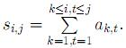

Задано матрицю чисел a[ij], де 1 ≤ i ≤ n, 1 ≤ j ≤ m. Для всіх i, j знайдіть

Вхідні дані:

У першому рядку записано розміри матриці - n, m (1 ≤ n, m ≤ 1000). У наступних n рядках записано по m чисел a[ij] (1 ≤ a[ij] ≤ 1000), відокремлених пропуском.

Вихідні дані:

Виведіть n рядків по m чисел S[ij].